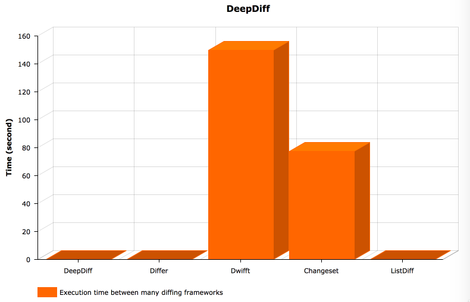

# DeepDiff

[](https://circleci.com/gh/onmyway133/DeepDiff)
[](http://cocoadocs.org/docsets/DeepDiff)
[](https://github.com/Carthage/Carthage)
[](http://cocoadocs.org/docsets/DeepDiff)
[](http://cocoadocs.org/docsets/DeepDiff)


**DeepDiff** tells the difference between 2 collections and the changes as edit steps. It works on any collection of `Equatable` and `Hashable` items.

- [A better way to update UICollectionView data in Swift with diff framework](https://medium.com/flawless-app-stories/a-better-way-to-update-uicollectionview-data-in-swift-with-diff-framework-924db158db86)

<div align = "center">


</div>

## Usage

### Basic

The result of `diff` is an array of changes, which is `[Change]`. A `Change` can be

- `.insert`: The item was inserted at an index
- `.delete`: The item was deleted from an index
- `.replace`: The item at this index was replaced by another item
- `.move`: The same item has moved from this index to another index

By default, there is no `.move`. But since `.move` is just `.delete` followed by `.insert` of the same item, it can be reduced by specifying `reduceMove` to `true`.

Here are some examples

```swift
let old = Array("abc")
let new = Array("bcd")
let changes = diff(old: old, new: new)

// Delete "a" at index 0
// Insert "d" at index 2
```

```swift
let old = Array("abcd")
let new = Array("adbc")
let changes = diff(old: old, new: new, reduceMove: true)

// Move "d" from index 3 to index 1
```

```swift
let old = [
  City(name: "New York"),
  City(name: "Imagine City"),
  City(name: "London")
]

let new = [
  City(name: "New York"),
  City(name: "Oslo"),
  City(name: "London"),
]

let changes = diff(old: old, new: new)

// Replace "Imagine City" with "Oslo" at index 1
```

### Animate UITableView and UICollectionView

Changes to `DataSource` can be animated by using batch update, as guided in [Batch Insertion, Deletion, and Reloading of Rows and Sections](https://developer.apple.com/library/content/documentation/UserExperience/Conceptual/TableView_iPhone/ManageInsertDeleteRow/ManageInsertDeleteRow.html#//apple_ref/doc/uid/TP40007451-CH10-SW9)

Since `Change` returned by `DeepDiff` follows the way batch update works, animating `DataSource` changes is easy.

```swift
let oldItems = items
items = DataSet.generateNewItems()
let changes = diff(old: oldItems, new: items)

collectionView.reload(changes: changes, section: 2, completion: { _ in })
```

Take a look at [Demo](https://github.com/onmyway133/DeepDiff/tree/master/Example/DeepDiffDemo) where changes are made via random number of items, and the items are shuffled.

## How does it work

### [Wagner–Fischer](https://en.wikipedia.org/wiki/Wagner%E2%80%93Fischer_algorithm)

If you recall from school, there is [Levenshtein distance](https://en.wikipedia.org/wiki/Levenshtein_distance) which counts the minimum edit distance to go from one string to another.

Based on that, the first version of `DeepDiff` implements Wagner–Fischer, which uses [dynamic programming](https://en.wikipedia.org/wiki/Dynamic_programming) to compute the edit steps between 2 strings of characters. `DeepDiff` generalizes this to make it work for any collection.

Some optimisations made

- Check empty old or new collection to return early
- Use `Hashable` to quickly check that 2 items are not equal
- Follow "We can adapt the algorithm to use less space, O(m) instead of O(mn), since it only requires that the previous row and current row be stored at any one time." to use 2 rows, instead of matrix to reduce memory storage.

The performance greatly depends on the number of items, the changes and the complexity of the `equal` function.

`Wagner–Fischer algorithm` has O(mn) complexity, so it should be used for collection with < 100 items.

### Heckel

The current version of `DeepDiff` uses Heckel algorithm as described in [A technique for isolating differences between files](https://dl.acm.org/citation.cfm?id=359467). It works on 2 observations about line occurrences and counters. The result is a bit lengthy compared to the first version, but it runs in linear time.

Thanks to

- [Isolating Differences Between Files](https://gist.github.com/ndarville/3166060) for explaining step by step
- [HeckelDiff](https://github.com/mcudich/HeckelDiff) for a clever move reducer based on tracking `deleteOffset`

### More

There are other algorithms that are interesting

- [An O(ND) Difference Algorithm and Its Variations](http://www.xmailserver.org/diff2.pdf)
- [An O(NP) Sequence Comparison Algorithm](https://publications.mpi-cbg.de/Wu_1990_6334.pdf)

## Benchmarks

Benchmarking is done on real device iPhone 6, with random items made of UUID strings (36 characters including hyphens), just to make comparisons more difficult.

You can take a look at the code [Benchmark](https://github.com/onmyway133/DeepDiff/tree/master/Example/Benchmark). Test is inspired from [DiffUtil](https://developer.android.com/reference/android/support/v7/util/DiffUtil.html)

### Among different frameworks

Here are several popular diffing frameworks to compare

- [Differ](https://github.com/tonyarnold/Differ) 1.0.3, originally [Diff.swift](https://github.com/wokalski/Diff.swift)
- [Changeset](https://github.com/osteslag/Changeset) 3.0
- [Dwifft](https://github.com/jflinter/Dwifft) 0.8
- [ListDiff](https://github.com/lxcid/ListDiff) 0.1.0, port from [IGListKit](https://github.com/Instagram/IGListKit/)

💪 From 2000 items to 2100 items (100 deletions, 200 insertions)

```swift
let (old, new) = generate(count: 2000, removeRange: 100..<200, addRange: 1000..<1200)

benchmark(name: "DeepDiff", closure: {
  _ = DeepDiff.diff(old: old, new: new)
})

benchmark(name: "Dwifft", closure: {
  _ = Dwifft.diff(old, new)
})

benchmark(name: "Changeset", closure: {
  _ = Changeset.edits(from: old, to: new)
})

benchmark(name: "Differ", closure: {
  _ = old.diffTraces(to: new)
})

benchmark(name: "ListDiff", closure: {
  _ = ListDiff.List.diffing(oldArray: old, newArray: new)
})
```

**Result**

```
DeepDiff: 0.0450611114501953s
Differ: 0.199673891067505s
Dwifft: 149.603884935379s
Changeset: 77.5895738601685s
ListDiff: 0.105544805526733s
```



### Increasing complexity

Here is how `DeepDiff` handles large number of items and changes

💪 From 10000 items to 11000 items (1000 deletions, 2000 insertions)

```
DeepDiff: 0.233131170272827s
```

💪 From 20000 items to 22000 items (2000 deletions, 4000 insertions)

```
DeepDiff: 0.453393936157227s
```

💪 From 50000 items to 55000 items (5000 deletions, 10000 insertions)

```
DeepDiff: 1.04128122329712s
```

💪 From 100000 items to 1000000 items

```
Are you sure?
```

## Installation

**DeepDiff** is available through [CocoaPods](http://cocoapods.org). To install
it, simply add the following line to your Podfile:

```ruby
pod 'DeepDiff'
```

**DeepDiff** is also available through [Carthage](https://github.com/Carthage/Carthage).
To install just write into your Cartfile:

```ruby
github "onmyway133/DeepDiff"
```

**DeepDiff** can also be installed manually. Just download and drop `Sources` folders in your project.

## Author

Khoa Pham, onmyway133@gmail.com

## Contributing

We would love you to contribute to **DeepDiff**, check the [CONTRIBUTING](https://github.com/onmyway133/DeepDiff/blob/master/CONTRIBUTING.md) file for more info.

## License

**DeepDiff** is available under the MIT license. See the [LICENSE](https://github.com/onmyway133/DeepDiff/blob/master/LICENSE.md) file for more info.
